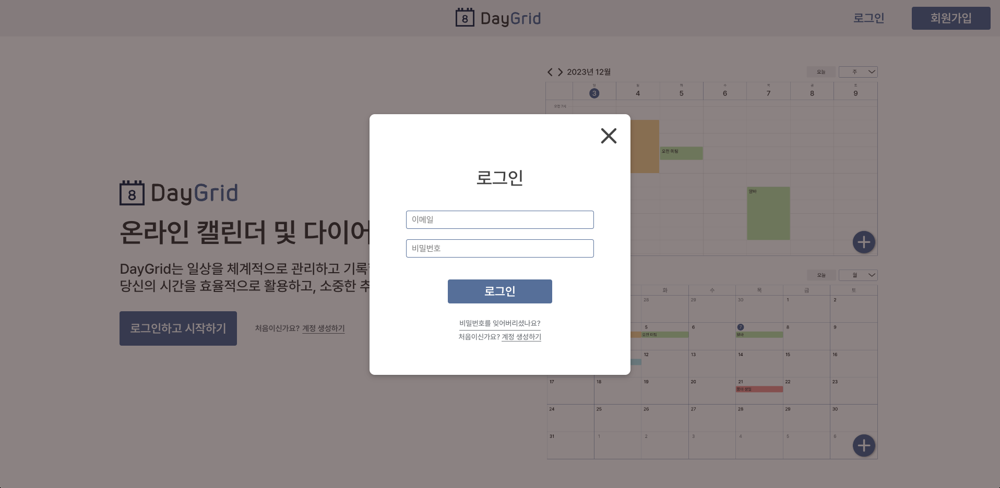
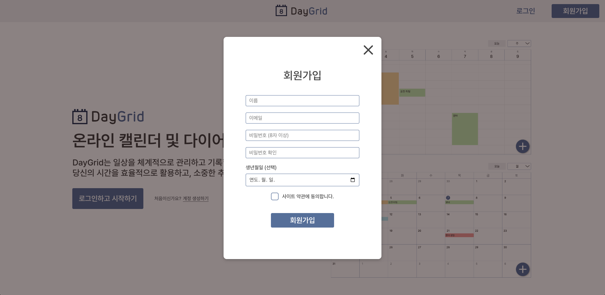
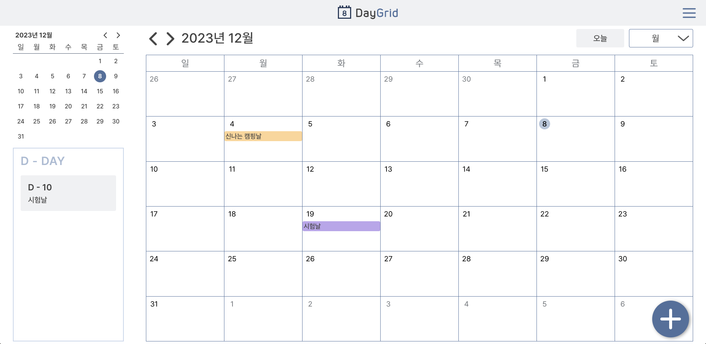
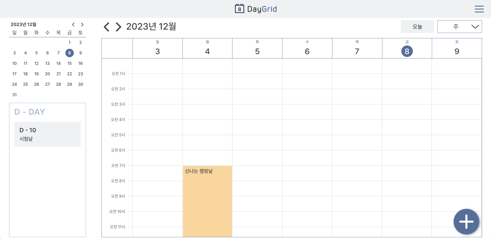
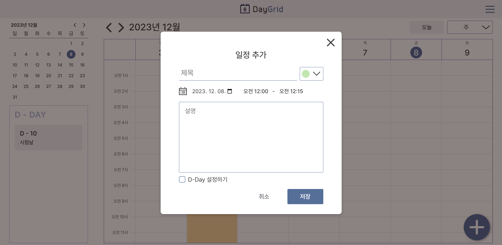
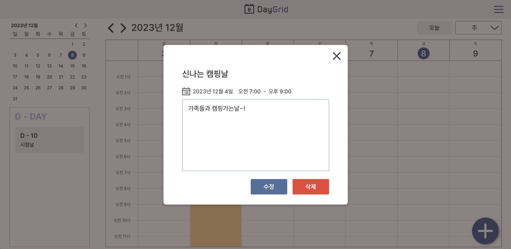
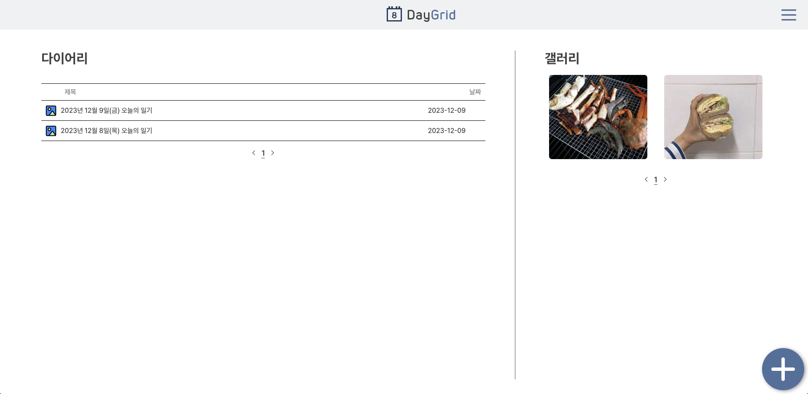
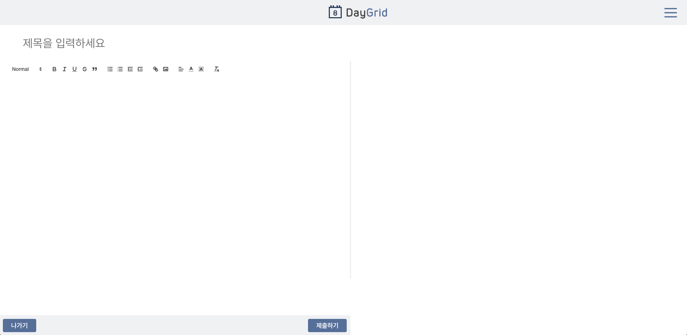
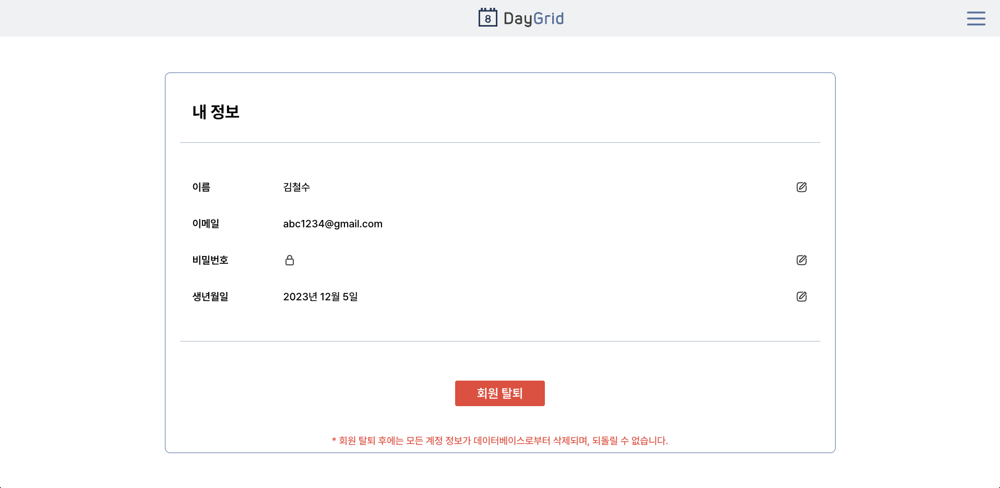

# DayGrid

일정을 기록할 수 있고 다이어리도 남길 수 있는 캘린더 어플리케이션, DayGrid 입니다.<br/><br/>
<strong>배포주소</strong><br/> http://daygrid.s3-website.ap-northeast-2.amazonaws.com/info<br/>
<br/>

## 🗓️ 서비스 소개

<br/>

### 회원가입 및 로그인

<table>
  <tbody>
    <tr>
      <td style='text-align: center'>
        로그인
      </td>
      <td style='text-align: center'>
        회원가입
      </td>
    </tr>
    <tr>
      <td style='vertical-align: top'>
        
      </td>
      <td style='vertical-align: top'>
        
      </td>
    </tr>
  </tbody>
</table>
<br/>

### 캘린더 및 일정 관리

<table>
  <tbody>
    <tr>
      <td style='text-align: center'>
        월간 달력
      </td>
      <td style='text-align: center'>
        주간 달력
      </td>
    </tr>
    <tr>
      <td style='vertical-align: top'>
        
      </td>
      <td style='vertical-align: top'>
        
      </td>
    </tr>
    <tr>
      <td style='text-align: center'>
        일정 추가
      </td>
      <td style='text-align: center'>
        일정 상세보기
      </td>
    </tr>
    <tr>
      <td style='vertical-align: top'>
        
      </td>
      <td style='vertical-align: top'>
        
      </td>
    </tr>
  </tbody>
</table>
<br/>

### 다이어리

<table>
  <tbody>
    <tr>
      <td style='text-align: center'>
        다이어리 리스트
      </td>
      <td style='text-align: center'>
        다이어리 작성
      </td>
    </tr>
    <tr>
      <td style='vertical-align: top'>
        
      </td>
      <td style='vertical-align: top'>
        
      </td>
    </tr>
  </tbody>
</table>
<br/>

### 마이페이지

<table>
  <tbody>
    <tr>
      <td style='vertical-align: top'>
        
      </td>
    </tr>
  </tbody>
</table>
<br/>

## ⚙️ 기술 스택

### FE


<br/>

### BE


<br/>

### Deployment


<br/>
<br/>

## 🐶 Team Maltesers

<table>
  <tbody>
    <tr>
      <td>
        
      </td>
      <td>
        
      </td>
    </tr>
    <tr>
      <td style='vertical-align: top'>
        <a href="https://github.com/ddussi" target="_blank">이마루한</a>
      </td>
      <td style='vertical-align: top'>
        <a href="https://github.com/Jess-Apr" target="_blank">한재연</a>
      </td>
    </tr>
    <tr>
      <td style='vertical-align: top'>
        <strong>FE</strong>
        <ul style="padding-left: 15px">
          <li>회원가입</li>
          <li>로그인</li>
          <li>다이어리 CRUD</li>
          <li>글 작성 에디터 & 이미지 업로드</li>
        </ul>
        <strong>BE</strong>
        <ul style="padding-left: 15px">
          <li>다이어리</li>
          <li>이미지 업로드</li>
          <li>JWT 토큰 인증</li>
          <li>로그아웃</li>
          <br/>
        </ul>
      </td>
      <td style='vertical-align: top'>
        <strong>FE</strong>
        <ul style="padding-left: 15px">
          <li>캘린더 페이지</li>
          <li>일정 CRUD</li>
          <li>마이페이지 CRUD</li>
          <br/>
        </ul>
        <strong>BE</strong>
        <ul style="padding-left: 15px">
          <li>회원가입</li>
          <li>로그인</li>
          <li>JWT 토큰 인증</li>
          <li>회원정보</li>
          <li>일정</li>
        </ul>
      </td>
    </tr>
  </tbody>
</table>
<br/>

## 📁 디렉토리 구조

#### Client

```
├─ public
└─ src
    ├─ assets
    │     ├─ header    // 헤더에 사용되는 날짜별 로고
    │     ├─ image
    │     └─ readme    // readme에 사용된 이미지
    ├─ components
    │     ├─ calendar  // 달력 페이지를 구성하는 컴포넌트
    │     ├─ common    // 헤더, 모달창 등 여러 페이지에 포함되는 컴포넌트
    │     └─ ...
    ├─ pages
    ├─ store
    │     ├─ auth      // 인증 토큰 관리를 위한 slice
    │     ├─ diary     // 다이어리 페이지 상태 관리를 위한 slice
    │     ├─ modal     // 모달 상태 관리를 위한 slice
    │     └─ store.ts
    ├─ hooks
    ├─ styles
    │     ├─ calendar  // 달력 페이지 스타일
    │     ├─ common    // 여러 페이지에 포함되는 컴포넌트 스타일
    │     └─ ...
    ├─ ts
    └─ utils
          ├─ http.ts   // 리액트 쿼리 함수
          └─ ...
```

#### Server

```
├─ data
│    ├─ auth.js   // JWT 토큰 인증 로직
│    └─ db.js     // 데이터베이스 연결
├─ routes         // 기능별로 요청 분리 후 라우팅 처리
│     ├─ calendar.js
│     ├─ diary.js
│     ├─ gallery.js
│     ├─ mypage.js
│     ├─ refresh.js
│     ├─ upload.js
│     └─ userVerify.js
└─ uploads        // 이미지 업로드 관련 로직
```
